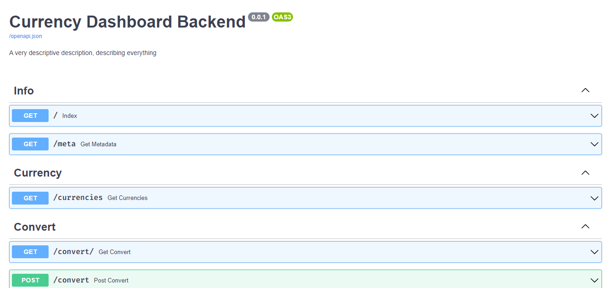
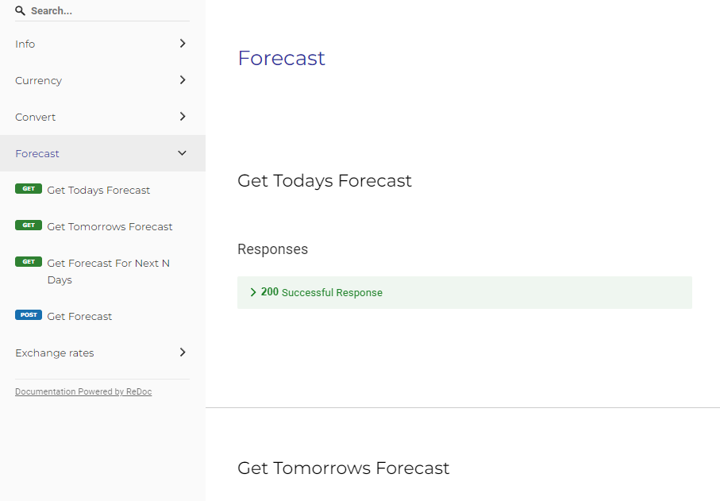

# Currency dashboard backend
Written in `FastAPI`

## Installing requirements
```bash
python -m pip install -r requirements.txt
```

## Starting the server

**Development**
```bash
uvicorn app:app --reload

**Production**
```bash
uvicorn app:app --host 0.0.0.0
```

---

## Testing the server
We're using [`pytest`](https://docs.pytest.org/en/7.0.x/) for testing the API. Run the tests using the following

```bash
pytest -v -s --cov
```
Current coverage of the project
```
Name                          Stmts   Miss  Cover
-------------------------------------------------
configs\__init__.py               0      0   100%
configs\settings.py               1      0   100%
models\__init__.py                0      0   100%
models\response\__init__.py       0      0   100%
models\response\meta.py           5      0   100%
routes\__init__.py                0      0   100%
routes\router.py                 40     11    72%
tests\__init__.py                 0      0   100%
tests\conftest.py                 4      0   100%
tests\test_routes.py             15      0   100%
-------------------------------------------------
TOTAL                            65     11    83%
```
---

## Documentations

### Swagger UI at `/docs`


### Redoc at `/redoc`

